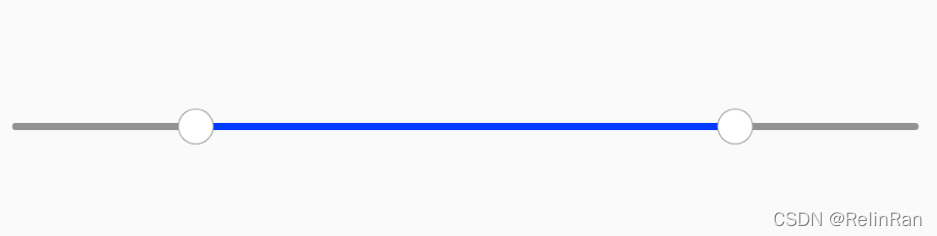

# IntervalSeekBar
自定义SeekBar区间进度拖动
# 预览

# 资源
|名字|资源|
|-|-|
|AAR|[internal_seek_bar.aar](https://github.com/RelinRan/IntervalSeekBar/blob/master/internal_seek_bar.aar)|
|Gitee|[IntervalSeekBar](https://gitee.com/relin/IntervalSeekBar)|
|GitHub |[IntervalSeekBar](https://github.com/RelinRan/IntervalSeekBar)|
# Maven
1.build.grade | setting.grade
```
repositories {
	...
	maven { url 'https://jitpack.io' }
}
```
2./app/build.grade
```
dependencies {
	implementation 'com.github.RelinRan:IntervalSeekBar:2022.6.21.1'
}
```
# xml
~~~
<com.androidx.widget.IntervalSeekBar
        android:layout_width="wrap_content"
        android:layout_height="wrap_content"/>
~~~
# attrs.xml
~~~
<attr name="barRadius" format="dimension" />
<attr name="lineWidth" format="dimension" />
<attr name="leftProgress" format="integer" />
<attr name="rightProgress" format="integer" />
<attr name="marginHorizontal" format="dimension" />
<attr name="marginVertical" format="dimension" />
<attr name="barColor" format="color" />
<attr name="seekBackgroundColor" format="color" />
<attr name="seekProgressColor" format="color" />
~~~
